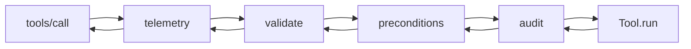

import { Aside } from '@astrojs/starlight/components';

# Middleware chain

Every tool call goes through a four-layer middleware chain before reaching the
tool's `run` method. The order is fixed and matters: each layer assumes the
ones outside it have already run.

## The chain



Read it as a Koa pipeline: each middleware wraps `next()`, runs setup, awaits
the inner chain, runs teardown, returns. The arrows show the call descending
to the handler then unwinding back out.

The composition primitive is in
[`packages/mcp-core/src/middleware/compose.ts`](https://github.com/cappylab/discord-mcp/blob/main/packages/mcp-core/src/middleware/compose.ts):
the same Koa-style dispatcher (with the standard "next() called twice" guard).

## Layer 1: telemetry (outermost)

Source: [`middleware/telemetry.ts`](https://github.com/cappylab/discord-mcp/blob/main/packages/mcp-core/src/middleware/telemetry.ts)

Wraps the entire call in an OTel SERVER span and emits the three tool-level
metrics (`mcp.tool.duration_ms`, `mcp.tool.calls`, `mcp.tool.errors`). Always
fires — even for calls that fail validation or preconditions, because we
want to **see** those failures in dashboards.

Why outermost: a call that gets rejected by validation should still be
counted (so you can spot a buggy agent that's spamming bad inputs). If
validation ran first and rejected before telemetry, you'd lose visibility on
exactly the calls that need monitoring.

## Layer 2: validate

Source: [`middleware/validate.ts`](https://github.com/cappylab/discord-mcp/blob/main/packages/mcp-core/src/middleware/validate.ts)

Runs the tool's zod schema against `arguments`. On failure, throws
`ValidationError` with a structured `issues` array (each issue has `path`,
`message`, `code`).

Why second: if args are invalid, preconditions can't safely inspect them
(e.g. `ConfirmRequired` reads `args.__confirm` — if `args` is the wrong
shape, that read might throw before the validation message ever surfaces).
Validating first means preconditions and the handler both work with a
typed, well-formed payload.

<Aside type="note">
Validation strips unknown keys by default (zod's `.strict()` is opt-in
per-tool). The `__confirm` raw flag is **not** in any tool's schema — it's
extracted from the raw arg payload **before** zod runs (see
[Confirmation](/discord-mcp/architecture/confirmation/)). This is the one
place the chain reads pre-validation args.
</Aside>

## Layer 3: preconditions

Source: [`middleware/precondition.ts`](https://github.com/cappylab/discord-mcp/blob/main/packages/mcp-core/src/middleware/precondition.ts)

Runs every `Precondition` piece declared by the tool. The two built-in
preconditions are:

- **`ConfirmRequired`** ([`preconditions/ConfirmRequired.ts`](https://github.com/cappylab/discord-mcp/blob/main/packages/mcp-core/src/preconditions/ConfirmRequired.ts))
  — gates destructive tools behind `__confirm:true` + `MCP_DRY_RUN=false`.
- **`CategoryEnabled`** ([`preconditions/CategoryEnabled.ts`](https://github.com/cappylab/discord-mcp/blob/main/packages/mcp-core/src/preconditions/CategoryEnabled.ts))
  — gates tools by `MCP_SCOPES` (read, moderate, members, channels, etc.).

Preconditions throw structured errors; the handler never runs if any
precondition fails.

Why before audit: a precondition that rejects (e.g. "wrong scope") shouldn't
audit the tool body — the tool didn't actually execute.

## Layer 4: audit (innermost)

Source: [`middleware/audit.ts`](https://github.com/cappylab/discord-mcp/blob/main/packages/mcp-core/src/middleware/audit.ts)

Captures the redacted args, the result (success / `tool_error` / thrown), the
duration, and the OTel trace/span IDs (if active). Emits **once per call** to
the configured sink. Skips calls where `tool.idempotent === true` — read
patterns are already in telemetry.

Why innermost: audit is meaningful only for actually-attempted operations.
A call rejected by validation or preconditions never reaches the handler;
auditing it would log non-events and balloon the trail.

## Why this order

The mental model is **outermost = most universal, innermost = most
specific**:

| Layer | Sees | Skips on |
| ----- | ---- | -------- |
| Telemetry | every call | nothing — always observes |
| Validate | every call passed by telemetry | malformed args |
| Preconditions | every call passed by validate | scope/dry-run/confirm violations |
| Audit | every call passed by preconditions | `idempotent: true` tools |

Each inner layer assumes the outer guarantees: audit knows args are
well-formed; preconditions know args parse; validate knows the call exists.

Reversing the order breaks each guarantee in a subtle way — e.g. moving
audit outside preconditions means logging "would have audited" events that
never executed, which is worse than silence for compliance review.

## Per-call context

Each layer receives a `MiddlewareContext`:

```ts
interface MiddlewareContext<Args = unknown> {
  readonly tool: { name: string; category: string; idempotent: boolean };
  readonly args: Args;
  readonly meta: Map<string, unknown>;
}
```

`meta` is the bag for cross-layer state (e.g. telemetry stashes the active
span; audit reads it to attach `trace_id`/`span_id`). Layers communicate via
this map rather than monkey-patching the context — keeps the type contract
clean.

## Adding a new layer

If you ever need a fifth layer (e.g. rate limiting per-tenant), insert it
**between preconditions and audit**: it should observe valid + permitted
calls, but its rejection should still count as a "tool not executed" for
audit purposes. Don't add it after audit — that's the contract boundary.

## Related

- [Operations → Telemetry](/discord-mcp/operations/telemetry/) — the metrics emitted by layer 1.
- [Operations → Audit](/discord-mcp/operations/audit/) — the AuditEvent schema emitted by layer 4.
- [Architecture → Confirmation](/discord-mcp/architecture/confirmation/) — the precondition behavior in layer 3.
- [Architecture → Error handling](/discord-mcp/architecture/error-handling/) — how layer-thrown errors surface to the client.
