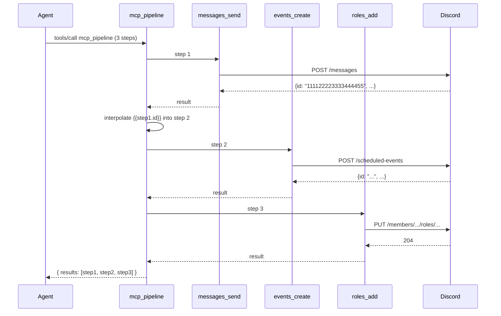

import { Aside } from '@astrojs/starlight/components';

# Pipeline

`mcp_pipeline` is the meta-tool that executes **N tool calls in a single MCP
request**, with later steps referring to earlier results via interpolation
syntax. It exists because some workflows are atomic in intent but require
multiple Discord REST calls — e.g. "post the announcement, schedule the
event, grant the role, all or nothing." Without a pipeline, the agent makes
three round-trips and has to handle partial failures itself; with one, the
server captures intermediate state and propagates failures cleanly.

## The flow



Sequential by default. Each step can read **any earlier step's output** via
the `{{stepN.path}}` syntax; later steps see the resolved values.

See [`pipeline-multistep` recipe](/discord-mcp/recipes/pipeline-multistep/)
for a worked example.

## Variable interpolation

Source: [`packages/mcp-core/src/pipeline/interpolate.ts`](https://github.com/cappylab/discord-mcp/blob/main/packages/mcp-core/src/pipeline/interpolate.ts)

Syntax:

- `{{stepN.field}}` — read field on the Nth step's result (1-indexed).
- `{{stepN.field.subfield}}` — dotted path traversal.
- `{{stepN.array[0]}}` — bracket index for arrays.
- `{{stepN.array[0].id}}` — combine.

Resolution happens at **dispatch time** for each step: the args are deep-cloned,
every string is scanned for `{{...}}`, and matches are replaced from the
results map. Resolution failures (path not found, wrong type) raise an
`INTERPOLATION_FAILED` error and abort the pipeline; nothing else runs.

Resolved values keep their type — `{{step1.count}}` evaluating to a number
yields a real number in the next step's args, not the string `"42"`.

## Recursion guard

<Aside type="caution">
**Pipelines cannot call pipelines.** A `mcp_pipeline` step that invokes
`mcp_pipeline` is detected at dispatch and rejected with the
`PIPELINE_RECURSION` error code. The reason: nested pipelines would multiply
the bulkhead pressure (see [Operations → Resilience](/discord-mcp/operations/resilience/))
and make state hand-off ambiguous (which step counter does the inner one
share?).
</Aside>

If you find yourself wanting nested pipelines, the right answer is to
flatten: write one pipeline whose steps **happen to be** what the inner
would have run. The interpolation syntax is powerful enough to express most
nested-pipeline shapes as a flat sequence.

## Why it exists

Three reasons:

1. **Atomic intent**: "announce + schedule + grant" is one operator action,
   not three. Capturing it as one MCP call gives the agent a clean
   success/failure contract instead of three independent round-trips with
   their own error states.

2. **Single observability unit**: one pipeline = one parent span (with N
   child spans) in OTel. Audit emits **one event per leaf**, but the parent
   span correlates them so you can reconstruct the workflow trivially.

3. **Captured intermediate state**: `step1.id` gets passed into step 2
   without the agent ever seeing it. Reduces token usage on the agent side
   (no need to round-trip "what's the message ID? OK now use it") and
   eliminates whole classes of "agent dropped a snowflake mid-prompt"
   bugs.

## Failure behavior

Three failure modes:

- **Pre-dispatch**: an interpolation pointing at a missing path. Raised as
  `INTERPOLATION_FAILED` before any tool runs. No partial state.
- **Mid-pipeline**: step N fails (validation, precondition, REST error).
  The pipeline captures the error in the results array, marks the pipeline
  as failed, and **does not run subsequent steps**. Earlier steps' Discord
  side effects already happened — the result envelope tells you exactly
  what completed.
- **Bulkhead saturation**: if a leaf fails with `bulkhead_saturated`, the
  pipeline propagates it. There is no automatic retry of the saturated
  step inside the pipeline (cockatiel's retry already ran for that step).

The result envelope shape:

```json
{
  "results": [
    { "step": 1, "tool": "messages_send", "ok": true, "data": { ... } },
    { "step": 2, "tool": "events_create", "ok": true, "data": { ... } },
    { "step": 3, "tool": "roles_add", "ok": false, "error": { "code": "..." } }
  ],
  "summary": { "total": 3, "succeeded": 2, "failed": 1 }
}
```

The agent can use `summary.failed > 0` as the single boolean to decide
whether to retry / surface to the human.

## Source map

| Concern | File |
| ------- | ---- |
| Tool definition | [`tools/meta/pipeline.ts`](https://github.com/cappylab/discord-mcp/blob/main/packages/mcp-core/src/tools/meta/pipeline.ts) |
| Sequential executor | [`pipeline/executor.ts`](https://github.com/cappylab/discord-mcp/blob/main/packages/mcp-core/src/pipeline/executor.ts) |
| Variable interpolation | [`pipeline/interpolate.ts`](https://github.com/cappylab/discord-mcp/blob/main/packages/mcp-core/src/pipeline/interpolate.ts) |

## Related

- [`pipeline-multistep` recipe](/discord-mcp/recipes/pipeline-multistep/) — worked example with three real tool calls.
- [Operations → Resilience](/discord-mcp/operations/resilience/) — the bulkhead is shared across pipeline children, not amplified.
- [Architecture → Components V2](/discord-mcp/architecture/components-v2/) — common pipeline destination is `components_v2_send`.
