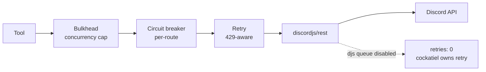

import { Aside } from '@astrojs/starlight/components';

# Rate limits

Discord enforces two layers of rate limits that any production bot has to
respect: a **global** ceiling (~50 requests/sec per token to most routes)
and **per-route** buckets (varying per endpoint, with `:id`-aware
discrimination — `/channels/A/messages` and `/channels/B/messages` are
separate buckets). When you exceed either, Discord responds with `HTTP 429`
and a `retry_after` header.

discord-mcp's job is to (1) respect those limits proactively, (2) handle
the inevitable 429 when proactivity fails, and (3) give the agent a clear
signal when it's pushing too hard.

## The model



Three quotas live in different layers:

- **Bulkhead** (concurrency): the `MCP_BULKHEAD_LIMIT` semaphore caps
  in-flight requests. Default 100; tighten to 20–30 for early "agent is
  over-parallelizing" signals.
- **Per-route circuit breaker**: opens after 10 failures on a single route
  in a sliding window. Stops hammering a flapping endpoint before Discord's
  Cloudflare layer treats us as abusive.
- **429-aware retry**: when Discord returns 429, the retry layer waits
  `retry_after` seconds (plus jitter) before re-issuing. Bounded by
  `MCP_RETRY_MAX_ATTEMPTS`.

See [Operations → Resilience](/discord-mcp/operations/resilience/) for the
exact env var contract.

## `@discordjs/rest` queue is DISABLED

By default, `@discordjs/rest` ships with its own retry queue: when it sees
a 429, it queues subsequent requests and retries the failing one
automatically. Sounds good, but it conflicts with Cockatiel:

- djs-rest retries **inside** its own request method (a single `await`
  in the tool blocks for the full backoff).
- Cockatiel wraps that await with **another** retry layer.
- A 429 fires; djs-rest waits `retry_after`; Cockatiel's timeout fires
  during the wait; the request appears to time out; Cockatiel retries.
  Now you have two unbounded retry sources fighting each other.

**Plan 8 Phase C disabled the djs-rest queue** by passing `retries: 0` to
the `@discordjs/rest` constructor. Cockatiel is the **single** retry
authority; djs-rest just makes the HTTP call and bubbles 429s up
immediately.

```ts
// From packages/mcp-core/src/rest/resilient.ts (paraphrased)
const rest = new REST({
  version: '10',
  retries: 0,           // ← cockatiel owns retry
  globalRequestsPerSecond: 0, // ← cockatiel/bulkhead owns concurrency
});
```

The `globalRequestsPerSecond: 0` similarly disables djs-rest's internal
global-rate-limit awareness; we let cockatiel + bulkhead handle that too.
Result: one retry layer, predictable backoff, clean traces.

## Webhook bypass

<Aside type="note">
**Webhooks have their own rate-limit bucket, separate from the bot's.**
This is a Discord-side property, not a discord-mcp one.
</Aside>

Webhook routes (`/webhooks/{id}/{token}` for execution,
`/webhooks/{id}` for management) use:

- A **per-webhook ratelimit** (typically 30/min) that's *not* shared
  with the bot's global bucket.
- A different identity (the webhook ID/token, not the bot token).

Practical implication: high-volume publishing (announcements, notifications,
log forwarding) should use webhooks, leaving the bot's rate budget free for
interactive work (commands, moderation, slash responses).

The trade-off: webhooks can't react, can't moderate, can't read history —
they're write-only. Use them for the publish-heavy half of your workload
and let the bot handle everything else.

See [`webhook-execute` recipe](/discord-mcp/recipes/webhook-execute/) for
worked patterns.

## Tuning by workload

### High-volume agent (announcement bot, log forwarder)

- `MCP_BULKHEAD_LIMIT=200` — raise concurrency cap; you're publish-heavy.
- `MCP_RETRY_MAX_ATTEMPTS=4` `MCP_RETRY_BASE_DELAY_MS=500` — be patient with
  occasional 429s; you have time.
- Use webhooks for the publishing path; reserve the bot for control plane.

### Low-volume agent (moderation, dashboards)

- Defaults are fine. `MCP_BULKHEAD_LIMIT=100` is way more than needed.
- Tighten if you want a clear "stop" signal: `MCP_BULKHEAD_LIMIT=20` —
  hits saturation fast if the agent loops, makes the bug visible.

### Pipeline-heavy agent (multi-tool atomic operations)

- Be careful with `MCP_BULKHEAD_LIMIT`: one pipeline that fans out to N
  children competes with itself for slots. See
  [Architecture → Pipeline](/discord-mcp/architecture/pipeline/) and
  [Operations → Resilience](/discord-mcp/operations/resilience/) for the
  pipeline + bulkhead interaction notes.
- Min sane value: 10. A bulkhead of 1 deadlocks the pipeline tool itself.

### Dev / test

- `MCP_RETRY_MAX_ATTEMPTS=1` to surface failures immediately.
- `MCP_CIRCUIT_ENABLED=false` so a flaky test doesn't open the breaker
  and corrupt subsequent test runs.
- `MCP_TIMEOUT_DEFAULT_MS=5000` to fail fast on hangs.

## Observability

When the system pushes too hard, the metrics show it:

- **`mcp.bulkhead.rejected.count`** rising → tighten parallelism in the agent
  loop, or raise the bulkhead.
- **`mcp.circuit.transitions{to="open"}`** firing → a route is genuinely
  failing; the breaker is doing its job. Investigate the route.
- **`mcp.deadletter.count{error_code="rate_limited"}`** → the agent
  exhausted retries on 429s; consider bumping `MCP_RETRY_MAX_ATTEMPTS`
  or batching via dedicated bulk tools (`messages_bulk_delete` instead
  of N individual deletes).

See [Operations → Telemetry](/discord-mcp/operations/telemetry/) for the
full metric catalog and recommended dashboards.

## Source map

| Concern | File |
| ------- | ---- |
| REST adapter (cockatiel + djs) | [`rest/resilient.ts`](https://github.com/cappylab/discord-mcp/blob/main/packages/mcp-core/src/rest/resilient.ts) |
| Cockatiel policy chain | [`rest/policy.ts`](https://github.com/cappylab/discord-mcp/blob/main/packages/mcp-core/src/rest/policy.ts) |
| Error mapping (429 → DiscordRateLimitError) | [`rest/errors.ts`](https://github.com/cappylab/discord-mcp/blob/main/packages/mcp-core/src/rest/errors.ts) |

## Related

- [Operations → Resilience](/discord-mcp/operations/resilience/) — retry/circuit/bulkhead env vars in detail.
- [Operations → Telemetry](/discord-mcp/operations/telemetry/) — how to observe rate-limit pressure.
- [Architecture → Error handling](/discord-mcp/architecture/error-handling/) — `DISCORD_RATE_LIMITED`, `BULKHEAD_SATURATED`, `CIRCUIT_OPEN` recovery hints.
- [`webhook-execute` recipe](/discord-mcp/recipes/webhook-execute/) — using webhooks to bypass the bot bucket.
